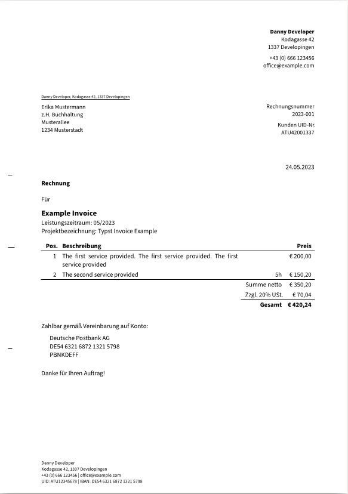

<!--
SPDX-FileCopyrightText: 2024 Philipp Klein <philipptheklein@gmail.com>
SPDX-FileCopyrightText: 2023 Kerstin Humm <kerstin@erictapen.name>

SPDX-License-Identifier: GPL-3.0-or-later
-->

# Typst invoice template



A template for writing invoices, which combines the [TOML-based invoice by @erictapen](https://github.com/erictapen/typst-invoice) with the great DIN 5008 conforming letter template [_typst-letter-pro_](https://github.com/Sematre/typst-letter-pro).

As in _typst-invoce_ the data for an invoice is stored in a TOML file (`invoice.toml`), so it is easily editable and can even be produced by another program.

## Specifics

The template strives to adhere to the requirements of an Austrian B2B invoice with sales tax.

Pull requests to fix mistakes or make template usable by a wider audience are welcome.

## Building

For compiling the PDF file just run

```
typst compile invoice.typ invoice.pdf
```
